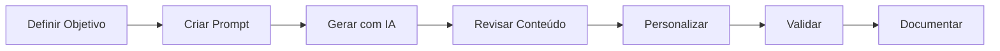

# 📐 Metodologia Aplicada

## Visão Geral

Este documento descreve a metodologia utilizada para criar planos de aula interativos e personalizados utilizando ecossistema de Inteligência Artificial.

## 🎯 Abordagem Metodológica

### 1. Design Thinking Educacional

Aplicamos o Design Thinking adaptado para educação em 5 fases:

#### Fase 1: Empatia
- Identificação das necessidades dos alunos
- Compreensão do contexto educacional
- Análise de objetivos de aprendizagem
- Mapeamento de recursos disponíveis

#### Fase 2: Definição
- Estabelecimento de objetivos claros
- Definição de público-alvo
- Identificação de pré-requisitos
- Determinação de resultados esperados

#### Fase 3: Ideação
- Brainstorming de atividades
- Seleção de metodologias ativas
- Escolha de recursos didáticos
- Planejamento de avaliações

#### Fase 4: Prototipação
- Criação do plano de aula com IA
- Estruturação de conteúdos
- Desenvolvimento de atividades
- Preparação de materiais

#### Fase 5: Teste
- Validação da estrutura
- Refinamento do conteúdo
- Ajustes de timing
- Otimização de recursos

## 🤖 Integração com IA

### Ferramentas de IA Utilizadas

1. **ChatGPT / Claude**
   - Geração de conteúdo educacional
   - Criação de exercícios e atividades
   - Sugestões de metodologias
   - Adaptação de linguagem

2. **Prompts Estruturados**
   - Templates otimizados
   - Parâmetros personalizáveis
   - Contexto educacional específico

### Processo de Criação com IA

## 📚 Estrutura dos Planos de Aula

Cada plano de aula segue uma estrutura padronizada:

### 1. Cabeçalho
- Título da aula
- Disciplina/Área
- Duração estimada
- Nível de dificuldade
- Público-alvo

### 2. Objetivos de Aprendizagem
- Objetivos gerais
- Objetivos específicos
- Competências desenvolvidas
- Habilidades trabalhadas

### 3. Conteúdo Programático
- Tópicos principais
- Conceitos-chave
- Pré-requisitos
- Interdisciplinaridade

### 4. Metodologia
- Estratégias de ensino
- Recursos didáticos
- Organização da aula
- Tempo de cada etapa

### 5. Desenvolvimento
- Introdução (contextualização)
- Desenvolvimento (conteúdo principal)
- Prática (atividades hands-on)
- Fechamento (consolidação)

### 6. Avaliação
- Critérios de avaliação
- Instrumentos avaliativos
- Feedback contínuo
- Autoavaliação

### 7. Recursos
- Materiais necessários
- Ferramentas digitais
- Referências bibliográficas
- Links úteis

## 🎨 Princípios Pedagógicos

### Aprendizagem Ativa
- Protagonismo do aluno
- Construção colaborativa
- Resolução de problemas
- Aplicação prática

### Personalização
- Adaptação ao ritmo individual
- Respeito aos estilos de aprendizagem
- Diferenciação de conteúdo
- Múltiplas formas de expressão

### Engajamento
- Contextualização relevante
- Desafios adequados
- Feedback imediato
- Gamificação

### Avaliação Formativa
- Acompanhamento contínuo
- Múltiplos instrumentos
- Feedback construtivo
- Reflexão sobre aprendizagem

## 🔄 Ciclo de Melhoria Contínua

### Implementação
1. Aplicar o plano de aula
2. Observar reações dos alunos
3. Coletar feedback
4. Registrar observações

### Análise
1. Revisar resultados obtidos
2. Identificar pontos fortes
3. Detectar oportunidades de melhoria
4. Comparar com objetivos

### Ajustes
1. Modificar estratégias
2. Atualizar conteúdos
3. Refinar atividades
4. Otimizar recursos

### Documentação
1. Registrar mudanças
2. Atualizar repositório
3. Compartilhar aprendizados
4. Criar versões melhoradas

## 📊 Métricas de Sucesso

### Indicadores Quantitativos
- Taxa de conclusão das atividades
- Desempenho em avaliações
- Tempo de engajamento
- Participação ativa

### Indicadores Qualitativos
- Satisfação dos alunos
- Qualidade das produções
- Profundidade de compreensão
- Transferência de conhecimento

## 🌟 Boas Práticas

### Para Prompts de IA
1. Seja específico e detalhado
2. Forneça contexto educacional
3. Defina formato desejado
4. Inclua exemplos quando possível
5. Itere e refine os resultados

### Para Criação de Conteúdo
1. Mantenha linguagem clara
2. Use exemplos práticos
3. Inclua elementos visuais
4. Promova interatividade
5. Valide com pares

### Para Implementação
1. Teste antes de aplicar
2. Prepare materiais com antecedência
3. Tenha plano B
4. Seja flexível
5. Documente experiências

## 🔗 Referências Metodológicas

- Bloom's Taxonomy (Taxonomia de Bloom)
- ADDIE Model (Análise, Design, Desenvolvimento, Implementação, Avaliação)
- Backward Design (Design Reverso)
- Universal Design for Learning (UDL)
- Flipped Classroom (Sala de Aula Invertida)

## 💡 Conclusão

Esta metodologia combina princípios pedagógicos consolidados com as potencialidades das ferramentas de IA, resultando em planos de aula que são:

- ✅ Estruturados e organizados
- ✅ Personalizáveis e adaptáveis
- ✅ Baseados em evidências
- ✅ Escaláveis e reutilizáveis
- ✅ Alinhados com boas práticas educacionais

---

📝 **Nota**: Esta metodologia é flexível e deve ser adaptada conforme o contexto, recursos disponíveis e necessidades específicas de cada situação educacional.